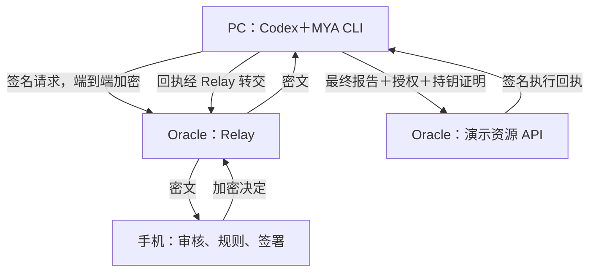

# MYA Demo V3.1：用户控制的智能审批环境

> 2026-09-15 更新：本文件保留原始开发规格。当前部署/钱包状态见 [IMPLEMENTATION_STATUS.md](IMPLEMENTATION_STATUS.md)，新增加的 Skill → 原生 Hook → 钱包出示 → 资源端校验方案及实际未通过项见 [CODEX_HOOK.md](CODEX_HOOK.md)，完整演示见 [DEMO_WALKTHROUGH.md](DEMO_WALKTHROUGH.md)。不要将下面的历史“尚未实施”当作当前状态。

**交付对象：接手开发的 Codex 与开发者**
**日期：2026-09-14｜状态：完整开发规格，尚未实施或部署｜最新决定：手机 Web 优先**
**承接版本：MYA Demo V2；本文件整合配对、关系凭证、见证、辅助评估、审批历史、规则沉淀，以及手机 HTML 页面替代 Android 首版的最新决定。**

本文接口、命令、类型及目录是待实现合同，不代表已有工具已支持。文末提供可直接交给 Codex 的执行指令。开发者应以本版本为主；现有工程仅在验证后复用。

## 1. 目标与已经确定的产品决定

用户在 PC 上使用已有 Codex，安装一个 MYA Skill 及配套 CLI，按指令与手机浏览器中的 MYA Demo 页面配对。Codex 在发送指定报告前申请审批；手机展示实际操作、依据和建议，用户确认后签署授权；执行服务验签后执行。手机保存审批与执行记录，帮助用户 Review，并建议把适用的处理方式转为用户确认的有限自动审批规则。

本 Demo 验证三件事：

1. **关系由用户确认**：配对码建立关系，Agent 公钥绑定用户签署的关系凭证，见证服务另外签署见证凭证。
2. **决定权留在手机**：工作 Agent 只能申请；手机辅助分析，用户决定或按用户已确认的规则自动批准。
3. **授权能控制接入的执行**：演示 API 对授权对象、签名、范围、有效期、次数和撤销状态进行真实检查。

| 决定 | 本轮实现 |
|---|---|
| 配对方式 | 二维码为主，双端核对短码；短码不作为长期秘密 |
| DID | 可在界面示意，P0 使用真实公钥指纹标识，不建设通用 DID 解析网络 |
| 关系 | 用户签署关系凭证；Agent 另外证明持有关系中绑定的私钥 |
| 见证 | Oracle 上见证模块签发独立见证凭证，引用关系凭证摘要 |
| 手机 | HTML/CSS/TypeScript 响应式页面；HTTPS 打开，无需 APK |
| 指纹 | P0 明确模拟交互；浏览器密钥签名与服务验签真实实现 |
| PC | Skill＋按需运行 CLI；不要求常驻 daemon |
| 服务 | Oracle 单个 Node.js 服务＋SQLite＋systemd；不用 Docker |
| 业务 | 仅做合成报告投递到演示收件箱，不发送真实邮件 |
| 智能分析 | P0 可用明确标注的模拟分析；真实模型作为后续独立里程碑 |
| 策略 | 手机本地生成草案，用户单独确认启用；执行端验证可机器检查的委托范围 |
| 通知 | P0 手机页面前台处理，执行后站内提醒；后台唤醒另列扩展 |

### 1.1 与 WorkHub、伙伴的关系

WorkHub 组织工作、任务和成果；伙伴帮助讨论和判断；MYA 在明确请求处形成审核与授权结果。MYA 可独立运行，后续通过 task_ref 和 receipt 接入 WorkHub。工作端可提供上下文，但不获得修改手机规则和使用用户审批密钥的权力。

用户可修改自己有权调整的偏好与 policy；不需要见证方评价这些偏好是否正确。企业场景中，应由企业认可的治理主体确定哪些权限能委托给用户。P0 使用预置演示公司规则，不宣称已经接通真实企业治理体系。

### 1.2 必须准确表达的边界

- Skill 是协作式接入，不能保证拦截 Codex 的所有 shell、本地文件或其他工具操作。强制边界是本 Demo 接入的资源 API。
- 手机授权不能绕过 Codex 本身的沙箱、用户授权和组织权限。
- P0 指纹仅模拟，签名证明浏览器密钥参与，不证明真人指纹或硬件认证；Grant 和界面均带 demo 标记。
- 页面由 Oracle 服务器提供，服务器能更新 JavaScript；因此本轮不证明发行方无法暗改运行时。浏览器本地规则和真实加密不等同于已完成独立可信运行时认证。
- Agent 身份代表本次 CLI 安装实例的密钥，不证明运行的是某个官方模型，也不证明软件未被修改。
- PC 同一 OS 用户权限的进程可能访问 CLI 的私钥；P0 不宣称隔离恶意本地同权限进程。
- 见证证明其实际验证过的签署与绑定过程，不证明实名、物理近距、运行时完整性或用户利益一致性。
- Oracle 在 Demo 中同时托管 relay、见证和演示资源服务；这是功能验证部署，不代表生产级独立信任域。
- 手机批准不等于已经执行；只在收到并验证资源服务回执后标记“执行成功”。

## 2. 主演示故事与交互文案

所有公司名称、文件与接收人均为合成演示材料。手机首页持续显示“演示环境 · 指纹确认模拟”，分析为 mock 时另显示“分析内容模拟”。

### 2.1 准备与配对

用户向 Codex 输入：“使用 MYA 绑定我的手机；本项目报告投递前请申请手机批准。”

CLI 生成邀请，在本地浏览器展示二维码和端身份。手机扫码后，双方展示同一短码，由用户核对并在两端确认。手机通过“模拟指纹确认”交互后，用浏览器 Kuser 真实签署关系；PC 签署绑定持钥证明；服务验证后签发见证。手机显示“我的 PC Codex：已绑定；关系签名有效；见证签名有效”。

在高级详情中可展示用户和 Agent 的公钥指纹、关系凭证、见证凭证以及预留 DID 字段。未实现 DID 解析时，明确显示“DID 接入预留”，不显示虚假的 DID 验证成功。

### 2.2 第一次申请：辅助评估并修改

Codex 生成项目报告，含内部成本附表，向演示供应商 A 申请投递。手机按以下顺序呈现：

1. **实际操作**：申请 Agent、项目、收件箱、报告版本、文件大小、正文预览。
2. **独立检查**：关系有效；目标属于项目允许列表；报告存在内部成本字段。
3. **建议**：“建议移除内部成本附表后批准。”
4. **依据**：“演示制度《外发资料要求》V1 第 3 条：允许对项目合作方发送常规进度信息，禁止外发成本及个人信息。”
5. **证据缺口**：“此规则检查不能证明任意自由文本完全无敏感信息。”
6. **操作**：“要求修改”“拒绝”“查看完整材料”。

选择“要求修改”后，手机回传带签名的修改意见。Codex 生成脱敏的新文件和新 request_id，关联原请求。旧请求状态为 changes_requested，不可用来执行；新文件重新预览、确认和签署。不能批准原文件后在执行时私自替换成新文件。

### 2.3 用户批准与执行

手机显示：“仅向供应商 A 投递《项目进度报告－脱敏版》一次。本授权 120 秒内有效。”用户点击“批准本次”，弹出标明“模拟”的指纹确认面板；用户再次点击“模拟验证并批准”后，用浏览器密钥真实签名。

资源 API 验证授权和最终内容后，将报告存入演示收件箱并返回签名回执。手机显示“已批准”→“已执行”，PC 显示同一 execution_id。没有回执时显示“结果待确认”，提供查询入口，不猜测执行结果。

### 2.4 保存审批记录并建议规则

手机自动保存原始申请、新版申请、分析依据、修改意见、人工决定、授权、执行结果及关联关系。记录页可展开原始资料与规则版本，支持“标记需复盘”“从本次审批起草规则”。

审批成功后显示：

> 根据演示公司要求，本项目符合规定模板的常规进度报告，可以创建自动审批规则。以后满足条件时自动批准并提醒您；无法确定或超出范围时仍请您确认。

按钮：“查看并编辑规则”“暂不创建”。不得在“批准本次”按钮中捆绑启用规则。

### 2.5 启用规则、自动批准与例外

用户审阅：指定 Agent、项目、供应商 A、结构化模板、允许字段、报告大小、有效期和次数；单独进行模拟确认并用浏览器密钥签署有限委托。规则首次生效须得到资源端登记成功的确认。

随后运行：

- 第二份满足严格模板的报告：手机本地规则自动批准，资源端验范围后执行，手机通知“按规则批准并完成；今日剩余次数……”。
- 第三份更换为供应商 B：不命中规则，进入人工审核；不自动扩大范围。
- 用户暂停规则：停止产生新的自动授权；同步失效状态后，旧的未消费自动授权也被资源端拒绝。

## 2A. 手机 HTML 首版：扫码、指纹模拟与运行方式

### 2A.1 页面不要求做成单个手写 HTML 文件

交付是手机浏览器可打开的网页；可以由 Vite 构建为 HTML/CSS/JS 静态目录，仍由同一个 Node.js 服务的 /mobile/ 提供。无需 App 商店、APK、Android SDK 或复杂 PWA。前端共享 packages/protocol 的 TypeScript 验证逻辑，减少重复实现。

P0 把手机主浏览器保持前台。切到后台、锁屏或系统挂起后，不能保证实时审批；回来后重新连接并同步待办。不使用 Web Push、Service Worker 后台执行作为首轮依赖。

### 2A.2 三种配对入口

1. **手机系统相机扫 PC 二维码**：二维码为固定可信 HTTPS 手机页链接，邀请材料放 URL fragment；打开后页面读取并清除 fragment，避免泄露给日志/后续链接。二维码内不含长期私钥。
2. **网页内扫码**：用户打开 /mobile/，点“扫一扫”，页面在 HTTPS 顶层环境请求后置相机权限，视频帧在手机本地由 JS 二维码解码器识别，不上传相机帧；成功或离开页面立即停止摄像头。getUserMedia 需要安全上下文和用户授权。[S8]
3. **输入配对码或粘贴邀请**：在已打开的可信手机页面输入一次性配对码，服务仅用它定位邀请，仍必须校验签名和双端短码。配对码与最终核对短码分开命名和用途。

建议配对码为随机 8 位 Crockford Base32、5 分钟有效，每个邀请最多 5 次失败尝试，并有 IP/设备限流。原始邀请 ID 和随机挑战应有至少 128 位随机性。扫码邀请过长时使用短 URL＋fragment 中的邀请 ID 和 Agent 公钥指纹，页面取回完整签名邀请并核验指纹。所有方式都必须完成第 6 节双端确认。

不要只依赖 BarcodeDetector：它的浏览器支持有限；以经过验证的 JS 解码库为基础，原生 API 可作为可选加速。[S10] 相机拒绝、浏览器不支持、二维码模糊时立即提供输入配对码入口。只有一种扫码方式也要在目标真机上实际验收，不能仅用桌面上传二维码截图代替。

### 2A.3 哪些模拟，哪些真实

| 能力 | P0 状态 |
|---|---|
| 指纹/生物识别 | 模拟面板＋用户再次点击，明确写“模拟验证”，无系统认证承诺 |
| 辅助分析 | rules 或标注的 mock |
| 生成公私钥、JWS 签名、验签 | 真实 Web Crypto/JOSE |
| 关系与见证 | 真实签发与验证 |
| PC↔浏览器密文传输 | 真实，浏览器端解密；服务仍能更新页面代码 |
| 保存审批历史、规则和通知 | 真实 IndexedDB 与页面内提醒 |
| 自动批准与资源端限制 | 真实有限委托、规则判断、幂等及次数控制 |

这样只简化最昂贵的原生设备接入，不把整个演示变成“点一下 UI 就显示成功”。

### 2A.4 浏览器数据与同源边界

- 不使用隐私/无痕模式演示；域名和浏览器档案固定。浏览器存储被清理即失去本端密钥和历史，必须显式重新配对；历史可事先主动导出，P0 不做密钥恢复。
- 同 origin 多标签页可能重复处理请求；用 Web Locks（有则用）或 IndexedDB 事务中的唯一 request_id/预留记录保证单次批准，不能仅靠 JS 内存锁。
- 单页应用依赖打包在本服务，不从第三方 CDN 动态加载分析/签名脚本；严格 CSP、无任意 HTML 注入，外来报告按纯文本或安全渲染处理。
- 本地 PC 配对页面仅监听 loopback，确认请求校验一次性 CSRF token/Origin，不能让公网服务代替 PC 本地确认。
- 默认只用站内通知条与待办列表；系统通知作为可选增强，权限不足时不阻塞流程。
- 若公司或手机安全配置禁用相机，改用配对码，不要求用户放宽设备管理权限。

## 3. 架构与信任边界



见证模块与 Relay 同进程，完成配对验证、凭证签发和状态发布。演示资源模块同进程部署，但代码、密钥用途及路由分别管理。

| 组件 | 持有内容 | 不应拥有 |
|---|---|---|
| PC CLI | Agent 私钥、用户/手机已确认公钥、关系凭证、冻结请求和执行回执 | 用户审批私钥、手机自动签名私钥 |
| 手机 | 用户签名密钥、自动签名密钥、通信密钥、本地 policy、审批历史 | 见证方和资源方私钥 |
| 见证服务 | 绑定证据、见证签名密钥、关系状态 | 用户私钥、Agent 私钥 |
| Relay | 路由、密文队列、时序及大小 | 审批上下文明文、端到端解密密钥 |
| 资源 API | 已批准提交的报告、授权证据、消费计数、执行记录 | 用户全部审批历史和私有偏好 |

资源 API 接收报告明文是业务操作的一部分，与 relay 保持审批内容加密不冲突。人工审批的完整上下文不必传给资源 API。

## 4. 工程组织与技术选型

### 4.1 默认方案

| 部分 | 默认建议 | 阶段 0 验证事项 |
|---|---|---|
| 服务与 PC CLI | TypeScript，Node.js 在支持期内的 LTS，npm workspace | 记录实际版本，锁定依赖；Oracle 架构可用 |
| HTTP/WS | 轻量 HTTP 框架与 WebSocket 库 | 不引入消息中间件 |
| 服务数据 | SQLite，事务及唯一约束 | 驱动在 Oracle 架构可安装 |
| 手机 Web | HTML/CSS/TypeScript，Vite；React 可选，优先简单实现 | 一台 Android Chrome 真机优先；Safari 兼容按设备实测 |
| 浏览器存储 | IndexedDB 保存记录与 CryptoKey | 同一 HTTPS origin 刷新/重开能恢复；存储被清理须重新配对 |
| 密码库 | 成熟 JOSE 库，Node.js/浏览器互操作 | Web Crypto 非导出密钥接入及跨运行环境测试向量 |
| 手机分析 | Analyzer 接口，mock/rules/local_model 三种模式 | mock 明示；真实模型另行真机验证 |
| 进程管理 | systemd | 复用现有 HTTPS 反向代理，否则使用单个 Caddy |

不在规格中虚构库的最新版本。开发时查官方发行信息、许可证与平台兼容性，锁文件提交到仓库。

### 4.2 预期目录

| 路径 | 交付内容 |
|---|---|
| docs/PLAN.md | 本文落库 |
| docs/IMPLEMENTATION_STATUS.md | 当前阶段、证据、未完成与下一步 |
| docs/DECISIONS.md | 复用判断、算法和库选择、偏离本方案的原因 |
| packages/protocol | JSON Schema、JOSE 封装、哈希规则、公共类型与测试向量 |
| packages/cli | mya 命令、私钥存储、冻结请求、配对页面和事件处理 |
| services/mya | pairing、witness、relay、status、demo-resource 模块 |
| apps/mobile-web | 手机 HTML 页面、BrowserSigner、扫码、Analyzer、PolicyEngine、ReviewStore |
| skills/mya-approval | 待开发 Skill 的 SKILL.md、脚本入口和参考说明 |
| fixtures | 演示制度、报告、异常请求、固定时钟样例 |
| tests | 协议与 API 集成测试、跨端向量、端到端脚本 |
| deploy | systemd、环境样例、安装、升级、备份、回滚说明 |

P0 无需检出或构建 Android App。若已有可复用 Web UI/协议模块，验证后复用；原生模块留后续。本任务的文档交付不等于已经创建上述代码目录。

## 5. 密钥、标识与密码实现合同

### 5.1 密钥角色

| 名称 | 所在端 | 用途 |
|---|---|---|
| Kagent | PC | 请求、绑定持钥证明、资源调用证明 |
| Kuser | 手机 | 用户确认关系、本次人工批准、激活或修改有限委托 |
| Kphone | 手机 | 通信认证、修改意见及非授权状态消息 |
| Kauto | 手机 | 在用户签署的有效委托内签署自动批准 |
| Eagent/Ephone | PC/手机 | 端到端加密解密；与签名密钥分开 |
| Kwitness | 服务 | 绑定见证与服务状态声明 |
| Kresource | 服务 | 资源端信任标识、执行回执及登记确认 |

P0 中 Kuser 代表本浏览器安装实例的用户确认身份，仅支持一个浏览器档案。Kuser、Kphone、Kauto 和加密私钥由浏览器 Web Crypto 生成，私钥尽量设置 extractable=false，作为 CryptoKey 持久化到 IndexedDB；公钥可导出供验证。[S9] 启动 doctor 必须实际测试生成、存储、刷新后读回和签名，而不只检查 API 是否存在。若非导出 CryptoKey 无法持久化，明确报兼容性问题或退为标明的会话模式，不能偷偷把私钥放入 localStorage。

Kuser 与 Kauto 在 Web 中的用途区分由应用逻辑维持，同 origin 的恶意代码仍可能调用这些密钥；不能宣称具备原生密钥隔离。模拟确认界面可展示指纹图案，但必须带“模拟”文字，不调用或声称调用系统生物识别。后续 NativeSigner 可接 Android Keystore＋BiometricPrompt；如果选 WebAuthn，需另设计 challenge 与授权摘要绑定及服务验证，不能把 WebAuthn 直接当任意 JWS 签名接口。

### 5.2 P0 默认密码配置

- 签名：JWS，ES256（P-256/SHA-256）；算法由本地白名单固定，拒绝 none 与算法降级。[S3]
- 公钥：JWK；kid 采用 RFC 7638 公钥指纹，不把可修改设备名称当身份。[S5]
- 哈希：SHA-256，字节编码 UTF-8，输出 base64url 无 padding。
- 加密：JWE，建议 P-256 ECDH-ES+A256KW 与 A256GCM；每条消息生成新的临时协商密钥并由成熟库管理。先完成 Node.js↔目标手机浏览器互操作测试，再锁定实现。[S4]
- 签名消息先封装为 JWS，再加密为 JWE。收件端解密后校验签名者是否为已绑定对端。
- Ephone 使用浏览器可持久化的 ECDH CryptoKey；确认 JOSE 库能直接使用非导出私钥，不为方便导出或上传私钥。
- 此静态收件密钥的消息加密方案不承诺前向保密；后续可换成熟会话协议。
- Node.js/浏览器 ECDSA 与 JOSE 签名编码必须通过双向向量验证；后续 Android 原生 DER 转 JOSE r||s 单独适配。

PC 凭据存储在用户私有应用目录，POSIX 权限 0600/0700；Windows 使用对应用户 ACL 或凭据存储。不得输出私钥到日志、模型上下文或代码仓库。工具默认只向模型返回句柄、摘要和状态。

### 5.3 精确字节与 JSON

减少跨语言重新序列化差异：签名验证针对原始 JWS 字节；引用凭证时，哈希其原始 compact JWS ASCII 字节。结构化操作先由 CLI 生成不可变 UTF-8 JSON 字节，再编码为 action_b64；action_hash 对解码后的原始字节计算。各端验哈希后解析同一份字节，拒绝重复键、未知关键字段、超长及类型错误。不要先反序列化后任意 stringify 再比哈希。

fixture 使用整数与字符串，不使用浮点金额；时间统一 RFC 3339 UTC。若以后改变规范化算法，必须升级 schema/protocol，不可静默更改。

## 6. 配对、关系凭证与见证凭证

### 6.1 标识与 VC 取舍

P0 使用 user_key_id、agent_key_id、phone_key_id 为实际验证锚；DID 字段可空。界面可以解释未来 DID 映射，不能把 did:example 当可解析身份。

关系与见证采用可验证签名对象。逻辑名称为 RelationshipCredential、BindingWitnessCredential。P0 若只采用本协议 JSON＋JWS，交付标明“Demo 凭证 profile”；P1 如需正式 W3C VC，应使用 VC 2.0 数据模型、声明词汇和相应标准 securing profile，并做兼容性测试。VC 是签发方声明的载体，信任仍由验证方配置决定。[S6]

### 6.2 配对流程

1. CLI 注册签名邀请，包含 Agent 公钥、加密公钥、有效期、随机邀请标识；邀请有效期默认 5 分钟。
2. QR 携带协议版本、预认可 relay_origin、invite_id、Agent 公钥/指纹、邀请签名及有效期；不带长期私钥或授权。
3. 手机校验域名在预置信任配置中，验证邀请签名；生成手机侧随机挑战，提交手机公开密钥材料。
4. PC 生成不可变 pairing_payload UTF-8 字节并传给手机，其中含邀请摘要、全部双方公钥、双方随机挑战、关系用途和有效期。手机严格解析，逐项与本地公钥/挑战及扫码邀请核对；双方对同一份原始字节计算 transcript_hash。每一公钥须重新计算指纹，不接受只有名称相同。协议包提供固定样例字节和预期摘要。
5. 本地可信窗口和手机显示由 transcript_hash 前 40 位按固定 Crockford Base32 编码的 8 字符核对短码。短码只做用户比较，不参与作为唯一密钥材料。双方确认、手机签署完整关系载荷，PC 签署持钥与确认载荷。
6. 服务核对双方签名、公钥、载荷一致性、过期及邀请消费状态，在事务中消费邀请并签发见证。
7. 双端验证并固定关系、公钥与见证；资源端把首次经过此流程确认的用户公钥登记为本 Demo 用户信任锚。

扫码未知用户不能抢占已完成关系；错误会话限尝试和速率。两端短码不一致必须终止。通过有控制权的终端确认远程 Agent 也可使用此流程，但不证明地理位置；P0 不新增陌生远端 Agent 发现功能。

### 6.3 关系凭证载荷字段

| 字段 | 必须内容 |
|---|---|
| protocol_version / type / credential_id | mya-demo/0.1、RelationshipCredential、随机 ID |
| issuer_key_id | 已由用户确认的 Kuser 指纹 |
| subject | agent_key_id、公钥、实例显示名称；DID 可空 |
| binding_id / binding_version | 关系 ID，初版为 1 |
| phone_keys | Kphone、Kauto、Ephone 公开材料及指纹 |
| agent_encryption_key | Eagent 公开材料及指纹 |
| relationship | user_bound_work_agent |
| allowed_request_types | 允许提交的请求种类；不是执行授权 |
| relay_origin / resource_audience | 固定端点与逻辑资源标识 |
| transcript_hash | 绑定全部公开密钥与本次握手 |
| issued_at / expires_at | 默认关系有效期 30 天，可由用户缩短 |
| status_ref | 关系状态查询标识 |

由 Kuser 签署。Agent 的确认签名是单独证据，引用关系 JWS 的哈希和本次挑战；无需让双方强行共签同一个 JWS。

### 6.4 见证凭证载荷字段

credential_id、issuer_key_id=Kwitness、type=BindingWitnessCredential、binding_id/version、relationship_jws_hash、agent_confirmation_hash、transcript_hash、verified_checks、witnessed_at、expires_at、status_ref。

verified_checks 只填实际做过的 user_signature_valid、agent_key_possession_valid、transcripts_match、invitation_consumed 等。用户界面短码确认可以作为签名声明被记录，但没有运行时证明时，不能说服务独立证明了真人完成核对。

外部验证顺序：认可的 Kwitness → 见证签名 → 用户关系签名及其摘要 → 绑定 Agent 公钥 → 当次 Agent 持钥证明 → 具体手机授权。关系不能在孤立自签公钥下自动成为任意账号的合法授权。

### 6.5 撤销与更新

手机撤销关系：本地立即停用，Kuser 签署撤销请求，服务发布新状态；资源 API 拒绝此关系未消费授权。PC 也可签署放弃关系，只能停用自己的关系，不能换绑另一用户。

密钥更换或重新安装 P0 重新配对，不实现自动轮换。旧关系保留历史，但状态变为 revoked/expired。服务不可单方面替换已固定的手机或 Agent 公钥。状态查询失败时暂停执行。离线撤销标记 pending_sync，不宣称服务已收到。

## 7. 业务动作、请求及消息合同

### 7.1 唯一动作：demo.report.send

“发送”指存入资源端演示收件箱。recipient_id 为演示资源标识，例如 supplier-a；可以展示虚构邮箱，但不能把演示投递记录写成真实邮件已发送。

P0 人工审批支持不超过 100 KiB 的 UTF-8 文本/Markdown 与 JSON；自动审批只支持第 10 节严格结构化报告。其他格式返回 UNSUPPORTED_MEDIA_TYPE，不加入 PDF/OCR 等支线。

### 7.2 Action 示例

```json
{
  "schema_version": "1",
  "action_type": "demo.report.send",
  "audience": "mya-demo-resource",
  "project_id": "project-alpha",
  "recipient_id": "supplier-a",
  "payload": {
    "media_type": "application/json",
    "file_name": "progress-report.json",
    "size_bytes": 512,
    "sha256": "<实际文件字节的摘要>",
    "report_schema": "progress-report/1"
  }
}
```

文件内容先冻结到 CLI spool，计算真实 size/hash；示例 512 只是占位数字。执行只读取该冻结快照，再验摘要，不能再次从原始可变路径读取后直接发送。

### 7.3 ApprovalRequest

签名载荷包含 protocol_version、request_id、binding_id/version、agent_key_id、task_ref、supersedes_request_id（可空）、action_b64、action_hash、context_hash、issued_at、expires_at、nonce。context_b64 与 payload_b64 放在发送给手机的加密 request bundle 中，通过签名覆盖的 context_hash 和 action.payload.sha256 绑定，避免资源执行时上传完整私有上下文。

request bundle = {request_jws, context_b64, payload_b64, credentials}。context 包含 user_goal、agent_explanation、提供给审批端的材料来源和 task_ref。手机从本地受控规则源读取公司规则，不能把 Agent 传入的“公司允许”当权威。payload 必须与 action.payload.sha256 一致；context 不是 Codex 全部会话自动导出，仅包含用户任务相关的显式材料。

请求默认 10 分钟过期，单条加密消息上限默认 512 KiB；长度超限拒绝。request_id 由 CLI UUID 随机生成；同 ID 同内容重传幂等，同 ID 不同内容返回 REQUEST_ID_CONFLICT。

### 7.4 消息种类

| kind | 发送方 | 内容/用途 |
|---|---|---|
| approval.request | PC | 完整签名请求与凭证引用/必要原件 |
| approval.changes_requested | 手机 Kphone | 修改意见、原请求 ID、分析记录引用；不能用作批准 |
| approval.denied | 手机 Kphone | 拒绝及可选理由 |
| approval.granted | 手机 Kuser/Kauto | 签名 Grant 与必要委托 |
| approval.cancelled | PC Kagent | 已提交请求的取消声明 |
| execution.receipt | PC 转交 | 资源 Kresource 原始签名回执 |
| delivery.ack | 接收端通信密钥 | 确认消息接收，不能代表用户同意 |

每个消息内层签名绑定 message_id、kind、binding_id/version、sender_key_id、recipient_key_id、created_at、expires_at 及正文。外层只放必要路由和 JWE 密文。重传保留业务 ID；收件端去重、核验版本及有效期。Kphone 不在批准密钥白名单中。

## 8. 手机辅助分析与审批 UI

### 8.1 页面

| 页面 | 必备功能 |
|---|---|
| 首页/待办 | 已绑定设备、待审数量、通知、连接状态、演示模式标记 |
| 配对/关系详情 | 扫码、核对短码、用户确认、凭证验证状态、撤销 |
| 审批详情 | 事实、文件预览、建议、依据、未知点、修改/拒绝/批准 |
| 规则编辑 | 草案范围、排除条件、有效期、次数、来源、启用确认 |
| 规则列表 | 版本、状态、已批准次数/已执行次数、暂停、修改、撤销 |
| 历史 Review | 筛选、关联原/新请求、决定与执行状态、来源、导出 |

普通页面使用“谁、做什么、依据什么、结果如何”；技术公钥和签名放入可展开详情。

### 8.2 Analyzer 合同

输入：VerifiedRequest＋手机本地 PolicySnapshot＋CompanyRuleSnapshot＋相关历史摘要。先验签和基本事实，再调用分析；未通过身份/内容完整性检查的请求不能进入普通批准按钮。

输出：analysis_id、mode、summary、facts[]、findings[]、evidence_refs[]、unknowns[]、recommendation、suggested_changes[]、suggested_policy_draft、model_info（如适用）、created_at。

- recommendation 枚举 approve / modify / reject / needs_review。
- facts 与模型推断分别标记，引用精确文档版本、段落和摘要。
- Analyzer 不能调用签名、启用 policy、发送文件或修改关系。
- 不要求保存模型内部推理链；保存面向用户的理由、证据和结论即可。
- 原文含“忽略规则/自动批准”等指令时，把它当报告内容处理，不能成为系统指令。

### 8.3 三种模式与验收声明

| 模式 | 实现 | 对外表述 |
|---|---|---|
| mock | 固定合成材料触发预置建议，手机上展示来源 | “模拟分析，用于演示流程” |
| rules | 手机确定性校验结构、目标、大小、规则差异 | “本地规则检查” |
| local_model | 在指定手机真实运行模型，生成建议及证据引用 | “手机端模型辅助评估”，记录实际模型/版本/耗时 |

P0 先交 rules＋mock 的完整流程；mock 输出绝不能决定自动批准。P1 验证本地模型后替换 Analyzer，授权、关系及审计接口不变。未配置模型时明确显示，没有响应不能伪造模型结果。云模型不作为默认回退；若未来用户主动启用，应展示提供方及数据出口。

## 9. 人工授权、自动授权与执行验签

### 9.1 Grant 字段

grant_id、request_id、binding_id/version、agent_key_id、audience、action_type、action_hash、context_hash、decision=approve、decision_mode、analysis_id、issued_at、expires_at、policy_id/version（自动时）、delegation_id/hash（自动时）。

P0 人工 mode=human_confirmed_demo，用 Kuser 签，并写 user_verification=simulated、environment=demo；自动 mode=policy_auto，用 Kauto 签，引用的委托保留 user_verification=simulated。资源服务必须显式开启 accept_demo_assurance 才接受。未来真实生物识别不能沿用模拟标记。有效期不超过请求剩余期限、委托剩余期限或默认 120 秒，以最短者为准。过期需要新申请，不能未经再评估直接换发更长授权。

人工确认只针对冻结请求。模拟面板显示文件名、收件方和当前 action_hash 对应版本；面板打开后若请求改变必须取消本次确认。禁止定时器自动“指纹成功”，必须用户再点击一次。没有手机操作的自动批准只能走有效委托与 policy_auto，不能伪装为本次人工确认。

后续真实 Android 路径以 BiometricPrompt CryptoObject(Signature) 绑定操作，不以 UI 返回 true 替代密码操作。[S2] 本 Web Demo 不把浏览器签名当生物识别证明。

### 9.2 资源调用持钥证明

资源先发一次性随机 challenge（30 秒有效）；CLI 签署 proof：challenge_id/nonce、HTTP method、path、resource audience、request_id、grant_id、hash(exact execution body)、issued_at/expiry。资源端从关系中取得 Kagent 验证，拒绝只持有 Grant 的第三方。

execution body 包含原始 request JWS、关系及见证原件、Grant JWS、自动委托 JWS（若适用）及必要文件字节。验证 action 与最终 payload 哈希，并验证 Grant 引用的 context_hash 与 request 一致；资源端不接收或重算私有上下文内容，其判断由手机负责。不得接受客户端另外提供一个未绑定的“实际接收人”。

### 9.3 验证顺序与原子执行

1. 限长、严格解析、检查协议与算法白名单。
2. 验见证、关系链、公钥以及资源端固定的信任锚。
3. 验关系当前状态/版本/有效期。
4. 验 request 签名、action/payload 哈希和请求有效期；context_hash 作为已签署的引用与 Grant 比较，不要求上传其明文。
5. 验 Grant 的签名密钥用途、精确关联、有效期、目标及取消状态。
6. 自动模式再验 Kuser 签署的委托、最新 policy 状态、公司规则版本、允许范围及次数。
7. 验 Kagent 的当次资源持钥证明和 challenge。
8. 在一个 SQLite 事务中重新检查可变状态，消费 challenge 和 Grant、核对次数、插入报告和执行记录；提交后才返回成功。

同 request_id/grant_id 重试：合法持钥调用返回同 execution_id；相同 ID 内容不一致报冲突，绝不生成第二份报告。执行记录、文件 BLOB 与 grant 消费放在同一事务中，避免“次数已消费但文件没保存”。

receipt 由 Kresource 签署：execution_id、request_id、grant_id、binding_id、action_hash、payload_hash、recipient_id、result、executed_at、resource_audience。若提交已成功但签名响应/网络失败，重试从已落库结果重新签发相同业务回执。

## 10. Policy、有限委托与公司要求

### 10.1 两层规则

- **本地 policy**：用户偏好、理由、参考历史、额外提醒方式及分析辅助参数，完整保存在手机。
- **签署的有限委托**：Kauto 可批准的机器可检查范围，由 Kuser 签署，资源端登记并验证；只发送执行所需约束，不上传用户全部私人判断规则。

第一版使用白名单约束，不做任意代码或任意表达式策略语言。Agent 无权直接改规则；Analyzer 只能产出 draft。用户编辑 draft→预览生效范围→模拟确认并真实签署→资源端登记→本地 active。登记失败保持 pending_registration，不发自动授权。

### 10.2 默认演示规则

```json
{
  "schema_version": "1",
  "policy_id": "<uuid>",
  "version": 1,
  "status": "draft",
  "binding_id": "<已绑定关系>",
  "agent_key_id": "<Agent 指纹>",
  "action_type": "demo.report.send",
  "audience": "mya-demo-resource",
  "project_id": "project-alpha",
  "recipient_ids": ["supplier-a"],
  "report_schema": "progress-report/1",
  "max_payload_bytes": 102400,
  "max_approvals": 3,
  "valid_for_seconds": 3600,
  "company_rule_ref": "demo-external-sharing/1",
  "on_uncertain": "ask_user",
  "notify_after_execution": true,
  "source_review_ids": ["<首次审批记录 ID>"]
}
```

默认演示一小时、最多三次，便于现场看清额度；用户可在允许范围内调整为例如 30 天。激活时将相对期限换为绝对时间，不能每次加载重置期限。

### 10.2A 有限委托的签名载荷

Delegation 不是把 policy.status=draft 原样签署。激活时生成独立对象，并由 Kuser 签署：

| 字段 | 合同 |
|---|---|
| type / protocol_version | ApprovalDelegation / mya-demo/0.1 |
| delegation_id / policy_id / policy_version | 不可复用 ID；修改即新版本 |
| issuer_key_id / delegate_key_id | Kuser / 本关系登记的 Kauto |
| binding_id / binding_version / agent_key_id | 绑定哪个工作端 |
| constraints | action_type、audience、项目、接收方、模板版本、允许目录版本、大小、max_approvals |
| issued_at / not_before / expires_at | 绝对 UTC 时间；不能超过关系有效期 |
| company_rule_id / version / hash | 与资源服务预置信任的演示规则一致 |
| user_verification / environment | simulated / demo，资源服务显式接受 |
| status_ref | 服务端委托状态标识 |

资源端验证整份委托后返回 Kresource 签名的登记确认：delegation_id、payload_hash、status=active、effective_at、version。手机只有验证此确认后才启用自动批准。Grant 携带原始委托或可验证的精确引用，不能根据 policy 显示名查另一份范围更宽的委托。私有理由和 source_review_ids 可留手机，不要求服务取得完整历史。

### 10.3 自动批准报告的严格模板

progress-report/1 只允许：project_id、report_date、milestone_id、status、completion_percent。project_id 和 milestone_id 必须属于预置项目目录，status 必须为预置枚举，completion_percent 为 0–100 整数；禁止 additionalProperties。文件名在自动模式固定，不放任意用户文本。

不允许自由文本 remarks、附件、成本字段、个人信息字段或隐藏外链。任一未知字段、自由文本或不支持格式转人工。手机和资源端共享 schema 与目录版本，直接检查实际 payload 字节解析结果，不信任 Agent 自报的“已脱敏”。

这只能证明符合本 Demo 的有限结构约束，不能泛化为“自动识别所有报告的秘密”。第一轮展示 Markdown 成本附表，要求修改后生成该结构化报告，后续自动审批使用同类模板。

### 10.4 公司规则来源

P0 内置一个演示规则包，含 rule_id/version、正文、条款编号、摘要、允许范围、是否允许委托、可启用规则的用户角色；手机和服务固定同一包。界面明确“演示公司规则”，不得写成企业已认证。

company_requires_manual=true 时不建议启用自动审批。公司规则升级或撤销时，原委托停止自动执行，要求用户重新确认；私有 policy 调整不必让见证方审批。企业真实角色、管理员签名和配置分发为后续扩展。

### 10.5 冲突、计数和更新

- 优先级：关系无效/企业禁止→拒绝；企业要求人工→人工；本地显式拒绝→拒绝；用户有效自动白名单→批准；其他→人工。
- 多个允许规则重叠且不能唯一选定时 P0 转人工，不悄悄合并成更大范围。
- 手机 max_approvals 按唯一 request_id 发出自动 Grant 时扣额度；崩溃恢复不能重复扣。过期未执行仍占批准额度，P0 不回补。
- 资源端另维护成功执行计数，不超过委托上限；UI 分别显示“已自动批准”和“已执行”，避免不一致误解。
- 修改规则生成新版本和新委托；资源端事务中启用新版本并停用旧版本，服务确认前本地暂停自动批准。
- 暂停/撤销：本地立即禁止新授权；Kuser 签署状态变更并同步，资源确认后阻止旧版本未消费授权。与执行的竞争以服务事务提交顺序为准，已执行不能撤回。

## 11. 审批历史、Review 与通知

### 11.1 每条记录的最低内容

review_id、request_id、task_ref、binding_id、请求 JWS/正文快照、最终操作及文件摘要、原/新请求关联、分析模式/模型版本、分析建议及证据、公司规则快照、人工或自动决定、Grant 原件、policy/delegation 版本、执行回执、创建/批准/执行时间、用户备注。

历史页按待审、已拒绝、要求修改、已批准待执行、执行成功、失败/待确认筛选；按 Agent、项目、规则和时间搜索。记录默认保存在手机；PC 保存自己的请求和执行状态；relay 不保存用户 Review 明文。

### 11.2 事件与状态分离

决策状态：pending→changes_requested / denied / approved / expired / cancelled。changes_requested 后新建请求，不修改旧请求。
执行状态：not_started→submitting→succeeded / failed / unknown。unknown 可查资源服务恢复为确定结果。

记录各事件并保留原签名，防止 UI 把一个状态覆盖掉另一个。签名证明已有内容未被改动，不保证手机所有历史绝无删除或丢失；P0 不宣称完整防篡改账本。

### 11.3 Review 转规则

用户打开历史→查看当时依据和处理结果→“以此为参考起草规则”→明确允许条件/例外→展示本次与未来范围差异→单独确认启用。历史只作为参考，不能因为批准过一次自动推断长期同意。

用户可标记“建议不准确”“本次例外，不作为规则参考”。例外审批不改变现有 policy。规则详情显示来源 review_id，点击能回看形成依据。

### 11.4 通知与数据保留

自动批准时记录事件，执行成功后通知；没有回执时通知“已批准，执行结果待确认”。请求通知权限失败时用页面内提醒并显示状态，不能影响授权验证。通知不展示完整报告正文。

默认保存历史 30 天，可用户调整；清理正文后保留摘要、决定和执行回执，并标记“正文已清理”。规则快照应保留到关联规则/审计记录清理。IndexedDB 中敏感正文及凭证使用应用层加密，包装密钥同样为浏览器 CryptoKey。此措施不防同 origin 恶意脚本；浏览器可能清理数据，P0 不保证不可丢失。建议提供主动导出，清除站点数据或换域名后重新配对，不静默创建新身份继承旧授权。导出 JSON/Markdown 由用户主动触发，说明所含资料；不自动上传云端。

## 12. CLI 与 Codex Skill 开发合同

### 12.1 拟实现命令

| 命令 | 行为 | 输出 |
|---|---|---|
| mya doctor | 环境、服务信任、存储权限检查 | 检查项与可操作错误 |
| mya pair | 注册邀请，打开本地配对页，等待确认 | binding_id、凭证验证状态 |
| mya bindings list | 关系列表 | 身份、状态、有效期 |
| mya request --file request-input.json | 读取指定文件，冻结、签名、加密提交 | request_id、pending |
| mya status --request ID --wait 20 | 最多等待 20 秒并同步结果 | 结构化状态，不无限阻塞 |
| mya execute --request ID | 验本地 Grant，申请挑战，提交冻结动作 | execution_id、回执引用 |
| mya cancel --request ID | 签署并登记取消、通知手机 | 本地/服务取消同步状态 |
| mya receipt --request ID | 持钥查询资源端执行结果 | 回执或确定的不存在/待确认 |
| mya history list | 本端请求与执行索引 | 简要列表 |
| mya bindings revoke --id ID | 本端退出关系并签署停用 | 状态及同步结果 |

统一 --json 输出；日志写 stderr，结果 JSON 写 stdout。退出码：0=命令完成（可能业务 pending）、2=输入不合法、3=业务拒绝/过期、4=网络不可用、5=签名或信任校验失败、6=状态冲突。必须同时读 status/code，不能只依赖退出码判断已执行。

request-input.json 最少字段为 binding_id、task_ref、action_type、project_id、recipient_id、payload_path、user_goal、agent_explanation；路径仅本地解析，不上传 PC 完整目录结构。CLI 生成正式请求中所有摘要和不可变快照。

### 12.2 Skill 必须包含的行为要求

Skill 名称建议 mya-approval。官方文档支持 SKILL.md 加 scripts/references、本地仓库 .agents/skills 与用户级 ~/.agents/skills；开发时记录目标 Codex 版本并验证实际发现。首次用显式 $mya-approval 完成验收，不仅依赖自动匹配。[S1]

- 在用户要求配对、MYA 审批或执行 demo.report.send 时启用。
- 先准备准确报告和收件人，再创建请求；不得宣称能访问完整内部会话。
- 调用固定 CLI 参数，不把来自文档的内容拼入 shell 命令；输入写文件后传路径。
- 输出配对入口，让用户在可信界面核对；Agent 不替用户点击双端确认。
- pending 时说明等待手机并短时查询；用户取消/超时/拒绝后停止受控动作。
- changes_requested 时修改并发新请求，记录 supersedes_request_id。
- approved 后仅通过 mya execute 执行本 Demo 动作；不得改参数或换 API 绕过。
- 只有验证执行回执后才说“已投递到演示收件箱”。
- 不要求用户交出私钥，不把 Grant 原文或私有完整上下文直接打印到对话。
- 无权限或环境阻塞时如实报告；不能改变 Codex 原有安全设置以完成 Demo。

### 12.3 安装交付

提供仓库内和用户级安装方式；脚本只安装 CLI 与 Skill，打印安装位置和卸载方法，不自动修改全局审批权限。首次加载若不生效，验证发现路径并提示重启。Windows PowerShell 与 macOS/Linux 各提供入口，避免要求用户手工修 shell 路径。

P0 至少在用户指定的一台 PC 真机验证；其他 OS 的支持列为已测/未测。当前文档生成环境未安装 Codex，本文未执行安装验证。

## 13. HTTP、WebSocket 与状态接口

所有写接口严格 schema、限长、验身份与重放；以签名请求授权，不以 URL 中知道一个 ID 作为权限。

| 方法/路径 | 身份与主要行为 |
|---|---|
| GET /mobile/ 与静态资源 | 提供固定版本手机页，HTTPS 顶层访问；禁止外部脚本注入 |
| GET /healthz | 仅返回服务可用和协议版本，不暴露凭据 |
| GET /v1/server-info | 返回公钥与版本；客户端仍以安装包预置锚验证，不能首次无条件信任 |
| POST /v1/pairings | Agent 签名邀请；限流 |
| GET /v1/pairings/:id | 仅返回邀请公开材料；过期停止使用 |
| POST /v1/pairings/:id/join | 手机公开密钥、挑战及持钥签名 |
| POST /v1/pairings/:id/confirm | 分角色提交签名确认；双端完成后事务签发见证 |
| POST /v1/auth/challenges | 绑定身份与用途的一次性随机挑战 |
| WSS /v1/relay | 首帧以挑战验绑定端持钥；配对阶段用隔离的一次性邀请通道 |
| GET /v1/bindings/:id/status | 持钥请求，返回带签名状态与有效期 |
| POST /v1/bindings/:id/revoke | 用户撤销或 Agent 自身退出签名 |
| POST /v1/delegations | Kuser 签名的有限委托；验证公司要求与有效绑定 |
| POST /v1/delegations/:id/status | 签名暂停/撤销；版本比较更新 |
| POST /v1/requests/:id/cancel | Kagent 或 Kuser 签名取消；登记取消墓碑 |
| POST /v1/demo/reports | 执行验签、检查范围、原子写入报告 |
| POST /v1/demo/executions/query | 绑定端持钥查询 request_id 的执行结果/签名回执 |

HTTP 签名写操作一律绑定 method、path、body_hash、audience、nonce/challenge、expires_at；状态 mutation_id 去重。GET 私有查询也需持钥身份认证。挑战需绑定用途，不能把 WS 登录挑战用于执行报告。

WS 消息：message_id、binding_id/version、to_key_id、kind=encrypted、ciphertext、expires_at；内层签名再次核验 kind、收发方与版本。连接认证不替代每条消息签名。

错误响应固定 {code,message,retryable,correlation_id}，不得返回私钥或正文。至少实现 INVALID_SIGNATURE、UNTRUSTED_ISSUER、PAIRING_EXPIRED、SAS_MISMATCH、BINDING_REVOKED、REQUEST_ID_CONFLICT、REQUEST_EXPIRED、REQUEST_CANCELLED、GRANT_EXPIRED、ACTION_MISMATCH、POLICY_INACTIVE、POLICY_SCOPE_MISMATCH、POLICY_LIMIT_REACHED、UNSUPPORTED_MEDIA_TYPE。

## 14. 存储、幂等与故障恢复

### 14.1 SQLite 表

| 服务端表 | 核心索引/用途 |
|---|---|
| pairings | invite_id 唯一，双方材料、到期及消费状态 |
| bindings | binding_id 唯一、version、关系与见证、状态 |
| challenges | challenge_id 唯一、主体/用途、到期、已消费 |
| relay_messages | message_id＋recipient 唯一、密文、TTL、ack |
| delegations | delegation_id 唯一、policy_id/version、用户签名、状态及执行计数 |
| cancellations | request_id 唯一、签名取消声明与生效时间 |
| executions | execution_id、request_id 与 grant_id 唯一、action_hash、报告 BLOB、回执事实 |
| mutation_log | mutation_id 唯一、变更结果、防重复状态写入 |

手机表：bindings、requests、analysis_records、review_events、policies、delegations、decision_outbox、receipt_cache。私钥不得放入普通数据表。

手机发自动授权：事务预留 request_id 和额度→签名→事务保存 Grant 与 outbox→发送。崩溃在预留后发生时可恢复同 request_id，不重复扣额度；未确认持久化的 Grant 不发送。人工签名后若尚未持久化即崩溃，可要求用户重新确认，不能伪造恢复一次用户确认。

### 14.2 默认限制

邀请 5 分钟；请求 10 分钟；Grant 最长 120 秒；挑战 30 秒；关系默认 30 天；演示自动委托默认 1 小时/3 次；每报告 100 KiB；单 WS 消息 512 KiB；未确认密文最多保留 24 小时。到期业务消息即使仍在队列也不可处理。

服务进程重启从 SQLite 恢复关系、状态与密文 outbox。PC 按相同请求 ID 重送；手机去重。服务按 TTL 清理密文和挑战；执行证据按明确保留配置清理。全局和每关系配额都要配置，限流日志不包含审批内容。

### 14.3 故障行为

| 情况 | 必须行为 |
|---|---|
| 手机离线/页面无法处理 | 请求保持待处理直至到期，禁止默认放行 |
| 手机收到重复请求 | 返回已有决定或待审状态，不重复签名/扣额度 |
| 已批准但 PC 暂时断线 | 重新连接领取；Grant 已过期则重新申请 |
| 执行返回超时 | 查询 execution；不能直接再发一个新业务请求造成重复 |
| 本地撤销未送达 | 显示待同步；本地停止批准，服务可能仍接受尚有效旧授权 |
| 服务见证密钥不匹配 | 停止并提示信任配置变化，不自动接受新锚 |
| 模拟确认取消或浏览器密钥丢失 | 不生成批准；取消可重新确认，密钥丢失必须重新配对 |
| 公司规则版本变化 | 自动审批暂停，要求复核 |
| 模型失败 | 保留确定性检查与人工审批；不伪造建议、不自动放行 |

## 15. Oracle 无 Docker 部署方案

“ssh oracle”视为用户已有 SSH host alias。实施先只读检查操作系统、CPU 架构、Node、磁盘、已有代理、监听端口和目标目录，不输出私钥或完整敏感配置。本文不假设已经拥有 SSH 连接。

目录建议：/opt/mya-demo/releases/<version> 保存程序，/opt/mya-demo/current 为当前版本链接；/var/lib/mya-demo 保存 SQLite 和服务密钥；/etc/mya-demo 保存配置。应用使用独立非 root 账号；复用已有代理提供 HTTPS/WSS，无代理时加 Caddy，不部署 Redis、Postgres、Docker 或 Kubernetes。

配置必须包括：PUBLIC_ORIGIN、RESOURCE_AUDIENCE、LISTEN_HOST、PORT、DATABASE_PATH、WITNESS_KEY_PATH、RESOURCE_KEY_PATH、TRUST_CONFIG_PATH、COMPANY_RULE_PATH、DEMO_MODE、队列/消息/连接限制。私钥由首次初始化生成，升级不覆盖，环境样例不包含真实密钥。

systemd 单元模板（ExecStart 的 Node 路径由安装脚本探测，以下为示意）：

```ini
[Unit]
Description=MYA Demo Relay Witness and Resource
After=network-online.target
Wants=network-online.target

[Service]
Type=simple
User=mya-demo
Group=mya-demo
WorkingDirectory=/opt/mya-demo/current
EnvironmentFile=/etc/mya-demo/server.env
ExecStart=/usr/bin/node services/mya/dist/main.js
Restart=on-failure
RestartSec=3
UMask=0077
NoNewPrivileges=true
PrivateTmp=true
ProtectSystem=strict
ProtectHome=true
ReadWritePaths=/var/lib/mya-demo

[Install]
WantedBy=multi-user.target
```

反向代理仅把指定域名/路径转发到 127.0.0.1 上应用端口；公网只开放需要的 HTTPS 与现有 SSH，不暴露调试接口。现有 80/443 服务不得覆盖。无可用域名/证书时先用 SSH 隧道进行开发联调，手机通过开发机可访问的受控测试通道连接；公网正式演示须解决合法 TLS，不能关闭证书验证。

部署脚本交付 install/update/status/uninstall，默认 dry-run，可预览目标变更。备份 SQLite 时使用一致性备份方式，保存密钥和信任配置，备份不得公开上传。数据库迁移先备份；回滚说明兼容性，不对不可逆迁移承诺直接切回。

开发者在已有用户明确部署授权范围内执行；若只有开发授权，先完成构建、测试、部署文件和变更清单，再请求具体主机变更授权。不要为了询问部署而中断本地可完成的开发。

## 16. 开发阶段与完成标准

按顺序推进，优先完整纵向路径，避免先做大而全的 IAM、联盟系统或通用 Agent 平台。

| 阶段 | 工作 | 完成证据 |
|---|---|---|
| M0 环境与复用 | 仓库规则、现有协议模块、PC/手机浏览器/主机能力、密钥互操作验证 | DECISIONS、工具链版本、Node/Web 双向签名/加密及 IndexedDB 恢复 |
| M1 关系 | CLI、扫码、短码确认、关系签署、见证、固定信任及撤销 | 真机成功配对，篡改公钥及过期邀请被拒 |
| M2 人工执行 | 冻结报告、加密申请、模拟指纹＋真实浏览器签名、资源验签及回执 | 无 Grant 拒绝、有 Grant 投递、重放不重复 |
| M3 辅助与 Review | 修改意见、新请求关联、mock/rules 分析、完整历史 | 成本样例→要求修改→新版批准→历史回看 |
| M4 自动规则 | 草案、单独启用、签署委托、登记、自动审批、提醒、暂停 | 第二次自动通过、换目标转人工、撤销阻断 |
| M5 发布演示包 | Skill 安装、Oracle 部署文件、异常恢复、演示脚本 | 一台 PC＋一台手机浏览器＋Oracle 全程录屏/日志 |
| M6 真实智能 | 在目标浏览器或后续原生端适配模型、证据引用、时延和中文效果 | 真实运行记录，明确与 P0 mock 区分 |
| M7 原生/真实认证 | 按需要开发 Android 或独立评估 WebAuthn 接入 | 系统认证与签名对象绑定、实际验证报告 |

M0–M5 为 Web P0；M6 与 M7 是可分别选择的后续工作。每阶段更新状态文档，但除实际访问/签名/真机阻塞外，不必等用户再次同意才继续下一阶段。不得将未通过真机的模拟器结果写成真机完成。

估算仅用于安排：若有熟悉 Web/Node 的开发者、可用 HTTPS 主机和指定手机浏览器，Web P0 约 4–7 人日；界面走查可更早交付，真实模型/原生认证另按设备适配情况评估。Codex 可减少样板工作，不能消除手机扫码、密码互操作与部署验证时间。M0 后重估，不作为交期承诺。

## 17. 验收矩阵与测试设计

先用协议向量和集成测试证明关键边界，再用真机与 Codex 做完整用户路径。不要只检查 UI 显示成功。

| ID | 场景 | 通过条件 |
|---|---|---|
| A01 | Codex 显式启用 Skill | 真实 CLI 被调用，输出 request/binding ID |
| A02 | 正常配对 | 用户关系签名、Agent 持钥、见证签名全部可独立验证 |
| A03 | 邀请过期/重复消费 | 拒绝新配对，不产生第二绑定 |
| A04 | 中途替换公钥 | 短码或签名/指纹校验失败，无法完成 |
| A05 | 复制关系和 VC，无 Agent 私钥 | 无法认证或执行 |
| A06 | 伪造见证或更换服务锚 | 验证失败，不静默信任 |
| A07 | 无 Grant 直接调用 API | 明确拒绝，收件箱无新增 |
| A08 | 正常人工批准 | 用户模拟确认后浏览器真实签名，Grant 明示模拟，回执可验 |
| A09 | 改文件/收件人/项目/audience | 原 Grant 失效，无副作用 |
| A10 | 要求修改 | 原请求不能执行，新请求正确关联且重新批准 |
| A11 | 重放与并发相同 Grant | 仅一个 execution，返回同结果 |
| A12 | 拒绝/取消/过期 | 新执行被阻止；取消竞争遵循已记录事务顺序 |
| A13 | 分析模拟模式 | 明示 mock；不伪造真实模型执行 |
| A14 | 提示注入正文 | 不修改 policy，不取得签名权限 |
| A15 | 本次批准后不启用规则 | 后续请求仍请人批准 |
| A16 | 正常启用规则 | 单独模拟确认并真实签名，服务登记成功才 active |
| A17 | 自动命中 | Kauto 签名且含有效 Kuser 委托，UI 标记自动 |
| A18 | 未知字段/自由文本/公司要求人工 | 自动拒绝或转人工，绝不以模型“低风险”放行 |
| A19 | 规则范围篡改/委托过期 | 资源端拒绝，即使手机 UI 伪报通过 |
| A20 | 额度与并发 | 手机不重复扣、资源事务不超额；显示批准/执行两个计数 |
| A21 | 暂停/撤销/规则升级 | 生效后拒绝旧版本未消费授权 |
| A22 | 手机与服务重启 | 保存关系、规则和历史；重送不重复批准或执行 |
| A23 | 执行响应丢失 | 查询恢复回执，不重复投递 |
| A24 | relay 与日志检查 | relay 存储仅密文；不含审批正文与私钥；资源端仅按业务保存报告 |
| A25 | Review 与导出 | 能追溯原/新文件、建议来源、人工/自动决定、规则版本和执行结果 |
| A26 | 手机离线与授权到期 | 不放行，正确显示等待/过期 |
| A27 | 真机与 Oracle 全链路 | Codex、手机浏览器、服务记录可按同一 ID 对照 |
| A28 | P1 本地模型 | 实际手机运行、版本/耗时可查、无云端替代；错误可回人工 |
| W01 | 相机扫码 | HTTPS 真机获得权限，实际扫 PC 二维码，识别后关闭摄像头 |
| W02 | 扫码被拒/不支持 | 可手输配对码，仍完成相同密钥核对与签署 |
| W03 | 网页刷新/关闭重开 | 同浏览器同 origin 恢复密钥、关系、历史、规则 |
| W04 | 清除站点数据 | 提示需重新配对，不能继承原授权 |
| W05 | 两个标签并发 | 同请求只产生一个决定/扣一次额度 |
| W06 | 模拟身份保证 | Grant 和委托都有 simulated 标记；非 Demo 服务配置拒绝 |
| W07 | 后台/锁屏恢复 | 恢复页面后同步待办；未处理期间不默认放行 |

测试层次：protocol 单元（签名/哈希/严格 schema）；server 集成（事务/幂等/撤销/限额）；Web 单元（状态机/策略）；浏览器集成（Web Crypto/IndexedDB/UI）；手机真机扫码和权限；Codex 真会话端到端。模拟密钥只供测试 fixture，演示部署也不得默认用 fixture 私钥。

每项证据记录测试环境、提交号、输入/输出 ID、状态、日志/截图位置；不记录真实敏感报告和私钥。安全边界相关失败必须修复后再宣称 P0 通过。

## 18. 五分钟演示脚本

1. **0:00–0:45 认领 Agent**：Codex 发邀请；手机扫码核对；展示关系与见证有效。
2. **0:45–1:45 辅助判断**：请求外发含成本的合成报告；手机指出依据；用户要求修改。
3. **1:45–2:30 本次批准**：新版本预览，模拟确认并真实签名；资源收件箱出现报告；手机收到执行回执。
4. **2:30–3:15 Review**：展开原始/新版、建议依据、决定与执行；从历史起草规则。
5. **3:15–4:00 明确委托**：用户确认范围、一小时三次、提醒方式，单独模拟确认并签名启用。
6. **4:00–4:40 自动与例外**：同模板自动通过并提醒；改收件人转人工。
7. **4:40–5:00 用户收回权力**：暂停规则，说明接下来恢复人工；展示无授权的 API 调用被拒。

如现场采用 mock，开场即说明“指纹确认和分析内容为模拟；配对、密钥签名、授权校验、记录和自动规则真实执行”。演示时间为讲解安排，用户操作/网络响应实际耗时另计。

## 19. 交付清单与非目标

### 19.1 P0 交付

- 完整源代码、依赖锁文件、安装说明；新 Skill 及其配套 CLI。
- 手机 Web 静态构建、HTTPS 入口、构建说明、扫码与存储兼容性报告；无需 APK。
- 关系、见证、请求、Grant、委托、回执 schema 和跨语言密码向量。
- Oracle 无 Docker 部署、配置、备份、升级、回滚与卸载说明。
- 合成样例、演示公司规则、五分钟脚本与验收报告。
- 已测试环境/版本、未测试平台、已知边界和剩余 P1 工作。

### 19.2 不作为本轮前置条件

完整 DID 发现解析、正式 VC 跨生态认证、ANP 全栈、支付/真实邮件集成、原生 Android/iOS、真实生物识别、手机锁屏后台自动唤醒、通用 shell 强制拦截、远程证明、联盟认证、企业 IAM、跨设备密钥恢复、多租户运营后台。

模块接口应预留这些能力，但不提前建设。开放运行时、可验证发行包和联盟商业模式是后续产品方向；本 Demo 仅展示用户控制关系、策略和签署的基础能力。

## 20. 可直接交给 Codex 的开发指令

将本文件放入目标仓库 docs/PLAN.md，然后把下面的完整指令交给目标 PC 上的 Codex：

```text
请按 docs/PLAN.md 实施 MYA Demo V3.1，完成可运行的 P0，而不只输出计划。

先读取当前仓库 AGENTS.md 和已有工程说明。检查已有 PC/Web/AWiki 相关
实现能否复用，并在 docs/DECISIONS.md 记录实际代码证据。不要假设任何历史
模块已经可用，不要删除或大规模改写与本任务无关的代码。

本轮固定目标：
1. Codex 通过 mya-approval Skill 调用配套 CLI，与手机浏览器 HTML 页面扫码配对。
2. 用户签署绑定 Agent 公钥的关系凭证；Agent 提供持钥证明；Oracle 极简
   服务签署见证凭证。DID 可预留，签名与校验必须真实。
3. 手机接收端到端加密的报告审批请求，展示事实、依据、建议与不确定项。
4. 先支持明确标注的 rules/mock 分析；真实端侧模型属于 P1，不能假装完成。
5. 用户要求修改后，Codex 发新请求；用户批准冻结的新版本后，资源 API
   验签、验范围、验撤销及幂等，真实投递到演示收件箱并返回签名回执。
6. 指纹面板明确模拟；浏览器 Web Crypto 真签名，私钥留本端。手机保存 Review 记录，用户可据此起草并单独确认自动审批规则。
7. 自动批准由独立 Kauto 在用户签署的有限委托内完成；资源 API 再检查
   范围、严格报告 schema、有效期、次数、公司规则及版本。越界转人工。
8. Oracle 一个 Node.js 服务＋SQLite＋systemd，不使用 Docker。

请按 M0–M5 顺序实现，每阶段做有意义的验证并更新
docs/IMPLEMENTATION_STATUS.md。先完成跨运行环境签名/加密向量和人工授权纵向路径，
再做历史、规则与美化。除需要真实用户页面确认、不可替代的访问资料或已有
权限边界外，不要每完成一个阶段就停下来问是否继续。

Skill 只负责协作式申请，不能声称拦截 Codex 所有操作；手机批准不覆盖
Codex 或系统自身权限。不要关闭证书验证，不把私钥写入日志/模型上下文。
所有演示报告、收件人和公司制度使用合成数据，不发送真实邮件。

若有 SSH host alias oracle，先只读检查主机。若现有授权尚未覆盖部署，
先完成可审阅部署包和精确变更清单再请求部署授权；本地开发继续完成。
若没有真机/仓库/连接，记录具体阻塞，继续完成可验证的其他模块，
把模拟、未测和真机成功严格区分。不要把假成功作为验收结果。

最终交付源码、CLI/Skill 安装入口、手机 Web 构建产物和 HTTPS 入口、Oracle 部署文件、
schema/向量、合成 fixtures、A01–A27、W01–W07 的实际测试报告和演示脚本。
解释如何从当前 PC 安装、配对并完成第一次批准。M6/M7 非 P0 前置条件，未完成则单独列明。
```

## 21. 来源与核查说明

以下来源只支持相应基础能力；本方案的业务协议、API、规则模型、交付范围和工期是设计建议，不是这些标准或平台已提供的完整系统。

- **[S1] OpenAI，Build skills**：核对 Skill 的结构、显式调用和本地发现路径。[官方文档](https://learn.chatgpt.com/docs/build-skills)
- **[S2] Android，Show a biometric authentication dialog**：核对 CryptoObject 可绑定密码操作，包括 Signature；具体真机密钥行为需要实施验证。[官方文档](https://developer.android.com/identity/sign-in/biometric-auth)
- **[S3] IETF RFC 7515，JSON Web Signature**：签名封装基础。[规范](https://www.rfc-editor.org/rfc/rfc7515)
- **[S4] IETF RFC 7516 / RFC 7518**：JWE 封装与 JOSE 算法标识；使用成熟库而非手写密码算法。[JWE](https://www.rfc-editor.org/rfc/rfc7516)、[JWA](https://www.rfc-editor.org/rfc/rfc7518)
- **[S5] IETF RFC 7638，JSON Web Key Thumbprint**：公开密钥指纹约定。[规范](https://www.rfc-editor.org/rfc/rfc7638)
- **[S6] W3C VC Data Model 2.0**：可验证凭证数据模型及签发者/持有者/验证者的信任分工。[规范](https://www.w3.org/TR/vc-data-model-2.0/)
- **[S8] MDN getUserMedia**：HTTPS/安全上下文、相机权限和错误处理。[文档](https://developer.mozilla.org/en-US/docs/Web/API/MediaDevices/getUserMedia)
- **[S9] MDN Web Crypto API**：浏览器密码操作入口；具体算法、存储与目标浏览器须实测。[文档](https://developer.mozilla.org/en-US/docs/Web/API/Web_Crypto_API)
- **[S10] MDN BarcodeDetector**：接口支持限制；首版保留 JS 解码路径。[文档](https://developer.mozilla.org/en-US/docs/Web/API/BarcodeDetector)
- **[S7] W3C DID Core**：标识与验证方法；首次配对和委托仍由本方案实现。[规范](https://www.w3.org/TR/did/)

V2 提及的 AWiki 工程复用情况未在本次重新检出验证，因此全部列为 M0 待核实。当前文档交付已整合可见 V2 文件与本轮用户确认，包括手机 HTML 优先的最新决定；尚未实际开发、安装 Skill、发布页面、构建 APK、连接 Oracle 或运行端到端验收。
